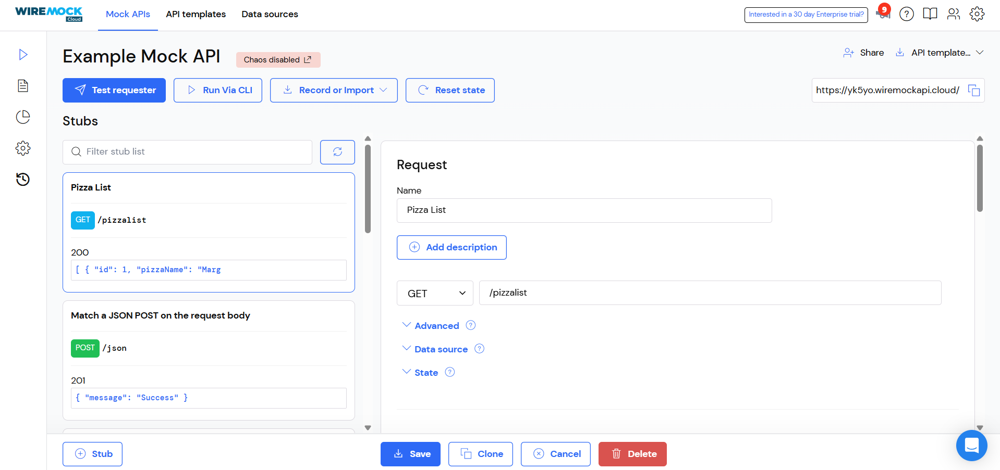
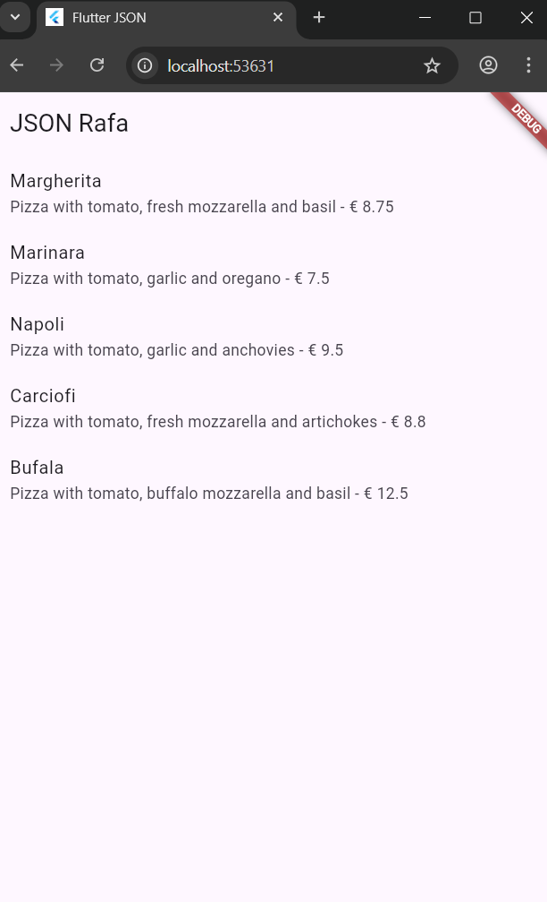
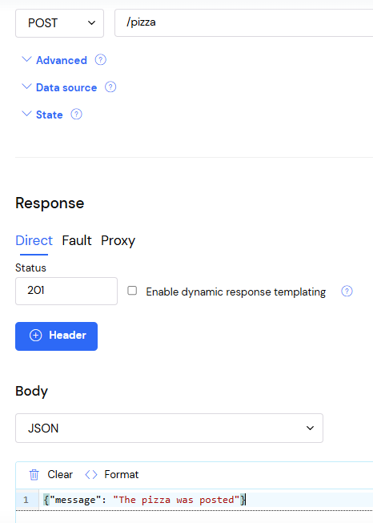
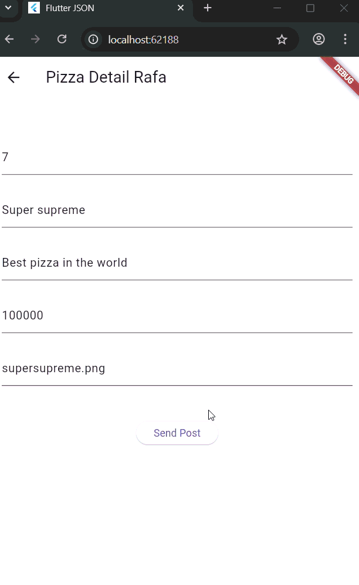
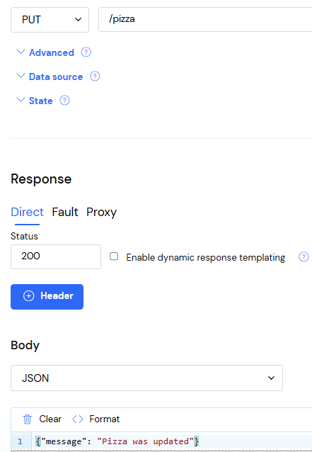
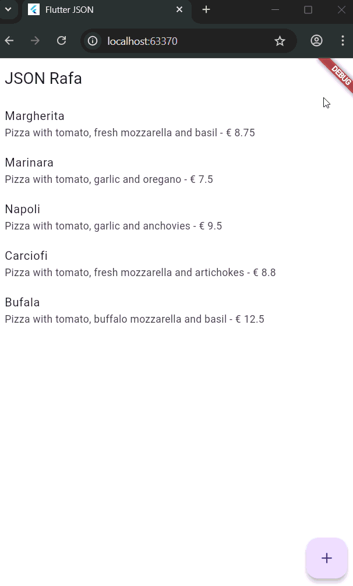
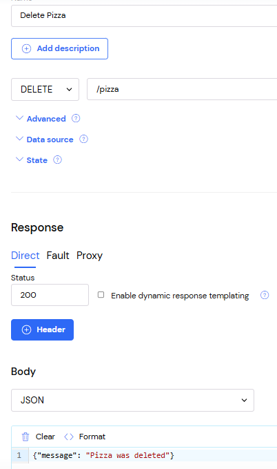
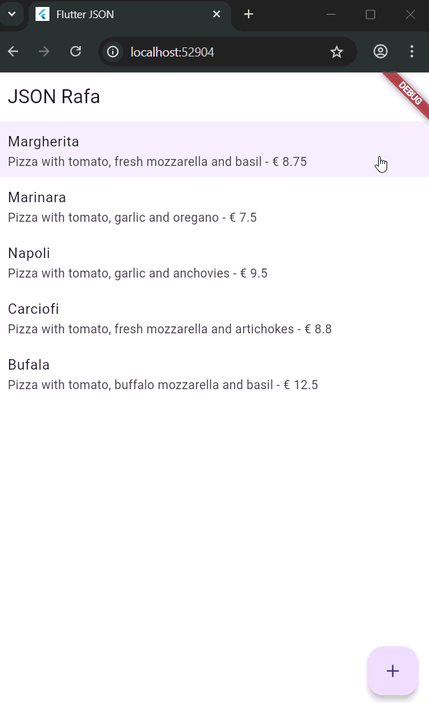

# Pemrograman Mobile - Pertemuan 14 (RESTful API)

**Nama : Rafa Fadil Aras**

**NIM  : 2341720007**

## Praktikum 1 - Membuat layanan Mock API

### Langkah-langkah praktikum 

- Langkah 1 - Daftar layanan Mock Lab
- Langkah 2 - Masuk ke layanan tersebut
- Langkah 3 - New stub
- Langkah 4 - Save stub
  
- Langkah 5 - Menambahkan dependensi
  ```dart
  flutter pub add http
  ```
- Langkah 6 - File baru httphelper.dart
- Langkah 7 - Menambahkan kode 
  ```dart
  import 'dart:io'; 
  import 'package:http/http.dart' as http; 
  import 'dart:convert'; 
  import '/model/pizza.dart'; 

  class HttpHelper {
      final String authority = 'yk5yo.wiremockapi.cloud';
      final String path = '/pizzalist';
    Future<List<Pizza>> getPizzaList() async {
      final Uri url = Uri.https(authority, path);
      final http.Response result = await http.get(url);
      if (result.statusCode == HttpStatus.ok) {
        final jsonResponse = json.decode(result.body);
        //provide a type argument to the map method to avoid type 
        //error
        List<Pizza> pizzas =
            jsonResponse.map<Pizza>((i) => 
              Pizza.fromJson(i)).toList();
        return pizzas;
      } else {
        return [];
      }
    }
  }
  ```
- Langkah 8 - Menambahkan method callPizzas
  ```dart
  Future<List<Pizza>> callPizzas() async {
    HttpHelper helper = HttpHelper();
    List<Pizza> pizzas = await helper.getPizzaList();
    return pizzas;
  }
  ```
- Langkah 9 - Edit class _MyHomePageState (Scaffold)
  ```dart
    Widget build(BuildContext context) { 
      return Scaffold(
        appBar: AppBar(title: const Text('JSON')),
        body: FutureBuilder(
            future: callPizzas(),
            builder: (BuildContext context, AsyncSnapshot<List<Pizza>> 
  snapshot) {
            if (snapshot.hasError) {
              return const Text('Something went wrong');
            }
            if (!snapshot.hasData) {
              return const CircularProgressIndicator();
            }
              return ListView.builder(
                  itemCount: (snapshot.data == null) ? 0 : snapshot.
  data!.length,
                  itemBuilder: (BuildContext context, int position) {
                    return ListTile(
                      title: Text(snapshot.data![position].pizzaName),
                      subtitle: Text(snapshot.data![position].
  description +
                          ' - € ' +
                          snapshot.data![position].price.toString()),
                    );
                  });
            }),
      );  
  }
  ```
- Langkah 10 - Run
  - Soal 1 
    - Menambahkan nama panggilan pada title app
      ```dart
      appBar: AppBar(title: const Text('JSON Rafa')),
      ```
    - Ganti warna
      ```dart
      theme: ThemeData(primarySwatch: Colors.pink),
      ```
    - Capture hasil 

      

## Praktikum 2 - Mengirim Data ke Web Service (POST)

### Langkah-langkah praktikum 

- Langkah 1 - Masuk ke layanan Mock Lab
- Langkah 2 - Melengkapi permintaan
- Langkah 3 - Save

  

- Langkah 4 - Membuat method baru postPizza
  ```dart
  Future<String> postPizza(Pizza pizza) async {
    const postPath = '/pizza';
    String post = json.encode(pizza.toJson());
    Uri url = Uri.https(authority, postPath);
    http.Response r = await http.post(url, body: post);
    return r.body;
  }
  ```
- Langkah 5 - Membuat file baru pizza_detail.dart
- Langkah 6 - Menambahkan import
  ```dart
  import 'package:flutter/material.dart';
  import 'pizza.dart';
  import 'httphelper.dart';
  ```
- Langkah 7 - Membuat statefulWidget 
  ```dart
  class PizzaDetailScreen extends StatefulWidget {
    const PizzaDetailScreen({super.key});
    @override
    State<PizzaDetailScreen> createState() => _PizzaDetailScreenState();
  }

  class _PizzaDetailScreenState extends State<PizzaDetailScreen> {
    @override
    Widget build(BuildContext context) {
      return Placeholder();
    }
  }
  ```
- Langkah 8 - Menambahkan lima TextEditingController
  ```dart
  final TextEditingController txtId = TextEditingController();
  final TextEditingController txtName = TextEditingController();
  final TextEditingController txtDescription = TextEditingController();
  final TextEditingController txtPrice = TextEditingController();
  final TextEditingController txtImageUrl = TextEditingController();
  String operationResult = '';
  ```
- Langkah 9 - Menambahkan override method dispose()
  ```dart
  @override
  void dispose() {
    txtId.dispose();
    txtName.dispose();
    txtDescription.dispose();
    txtPrice.dispose();
    txtImageUrl.dispose();
    super.dispose();
  }
  ```
- Langkah 10 - Return scaffold di method build()
  ```dart
  return Scaffold(
  appBar: AppBar(
    title: const Text('Pizza Detail'),
  ),
  body: Padding(
      padding: const EdgeInsets.all(12),
      child: SingleChildScrollView(
        child: Column(children: []),
      )));
  ```
- Langkah 11 - Edit properti children dari column
  ```dart
  Text(
    operationResult,
    style: TextStyle(
        backgroundColor: Colors.green[200],
        color: Colors.black),
  ),
  const SizedBox(
    height: 24,
  ),
  TextField(
    controller: txtId,
    decoration: const InputDecoration(hintText: 'Insert ID'),
  ),
  const SizedBox(
    height: 24,
  ),
  TextField(
    controller: txtName,
    decoration: const InputDecoration(hintText: 'Insert Pizza Name'),
  ),
  const SizedBox(
    height: 24,
  ),
  TextField(
    controller: txtDescription,
    decoration: const InputDecoration(hintText: 'Insert Description'),
  ),
  const SizedBox(
    height: 24,
  ),
  TextField(
    controller: txtPrice,
    decoration: const InputDecoration(hintText: 'Insert Price'),
  ),
  const SizedBox(
    height: 24,
  ),
  TextField(
    controller: txtImageUrl,
    decoration: const InputDecoration(hintText: 'Insert Image Url'),
  ),
  const SizedBox(
    height: 48,
  ),
  ElevatedButton(
      child: const Text('Send Post'),
      onPressed: () {
        postPizza();
      })    
  ```
- Langkah 12 - Menambahkan class _PizzaDetailScreenState
  ```dart
  Future postPizza() async {
    HttpHelper helper = HttpHelper();
    Pizza pizza = Pizza();
    pizza.id = int.tryParse(txtId.text);
    pizza.pizzaName = txtName.text;
    pizza.description = txtDescription.text;
    pizza.price = double.tryParse(txtPrice.text);
    pizza.imageUrl = txtImageUrl.text;
    String result = await helper.postPizza(pizza);
    setState(() {
      operationResult = result;
    });
  }
  ```
- Langkah 13 - Import file pizza_detail.dart di main
- Langkah 14 - Menambahkan FloatingActionButton
    ```dart
  floatingActionButton: FloatingActionButton(
    child: const Icon(Icons.add),
    onPressed: () {
      Navigator.push(
        context,
        MaterialPageRoute(
            builder: (context) => const PizzaDetailScreen()),
      );
    }),
  ```
- Langkah 15 - Run
  - Soal 2
    - Menambahkan field baru dalam JSON maupun POST ke Wiremock
    - Capture hasil 

      

## Praktikum 3 - Memperbarui Data di Web Service (PUT)

### Langkah-langkah praktikum 

- Langkah 1 - Masuk ke layanan Wiremock
- Langkah 2 - Melengkapi permintaan
- Langkah 3 - Save
  
  

- Langkah 4 - Membuat method baru putPizza
  ```dart
  Future<String> putPizza(Pizza pizza) async {
    const putPath = '/pizza';
    String put = json.encode(pizza.toJson());
    Uri url = Uri.https(authority, putPath);
    http.Response r = await http.put(
      url,
      body: put,
    );
    return r.body;
  }
  ```
- Langkah 5 - Menambahkan dua properti di PizzaDetailScreen
  ```dart
  final Pizza pizza;
  final bool isNew;

  const PizzaDetailScreen({
    super.key,
    required this.pizza,
    required this.isNew,
  });
  ```
- Langkah 6 - Override method initState()
  ```dart
  @override
  void initState() {
    if (!widget.isNew) {
      txtId.text = widget.pizza.id.toString();
      txtName.text = widget.pizza.pizzaName;
      txtDescription.text = widget.pizza.description;
      txtPrice.text = widget.pizza.price.toString();
      txtImageUrl.text = widget.pizza.imageUrl;
    }
    super.initState();
  }
  ```
- Langkah 7 - Edit method savePizza 
  ```dart
  Future savePizza() async {
  ...
      final result = await (widget.isNew
    ? helper.postPizza(pizza)
    : helper.putPizza(pizza));    
    setState(() {
        operationResult = result;
      });
    }
  ```
- Langkah 8 - Menambahkan properti onTap ke ListTile
  ```dart
  return ListTile(
    title: Text(pizzas.data![position].pizzaName),
    subtitle: Text(pizzas.data![position].description +
                  ' - € ' +
                  pizzas.data![position].price.toString()),
    onTap: () {
       Navigator.push(
          context,
          MaterialPageRoute(
             builder: (context) => PizzaDetailScreen(
                pizza: pizzas.data![position], isNew: false)),
    );
  ```
- Langkah 9 - Meruskan Pizza baru dan true untuk parameter isNew ke rute PizzaDetail
  ```dart
    floatingActionButton: FloatingActionButton(
            child: Icon(Icons.add),
            onPressed: () {
              Navigator.push(
                context,
                MaterialPageRoute(
                    builder: (context) => PizzaDetailScreen(
                          pizza: Pizza(),
                          isNew: true,
                        )),            
            );
        }),
  );
  ```
- Langkah 10 - Run
- Langkah 11 - Edit detail pizza 
  - Soal 3
    - Mengubah satu data dengan Nama dan NIM
    - Capture hasil 

      

## Praktikum 4 - Menghapus Data dari Web Service (DELETE)

### Langkah-langkah praktikum 

- Langkah 1 - Masuk ke layanan Wiremock
- Langkah 2 - Melengkapi permintaan
- Langkah 3 - Save
  
  
  
- Langkah 4 - Membuat method baru deletePizza
  ```dart
  Future<String> deletePizza(int id) async {
    const deletePath = '/pizza';
    Uri url = Uri.https(authority, deletePath);
    http.Response r = await http.delete(
      url,
    );
    return r.body;
  }
  ```
- Langkah 5 - Refactor itemBuilder dari ListView.builder
  ```dart
  return ListView.builder(
    itemCount: (pizzas.data == null) ? 0 : pizzas.data.length,
    itemBuilder: (BuildContext context, int position) {
        return Dismissible(
                    key: Key(position.toString()),
                    onDismissed: (item) {
                      HttpHelper helper = HttpHelper();
                      pizzas.data!.removeWhere(
                          (element) => element.id == pizzas.data![position].id);
                      helper.deletePizza(pizzas.data![position].id!);
                    },
  ```
- Langkah 6 - Run
  - Soal 4
    - Capture hasil 

      